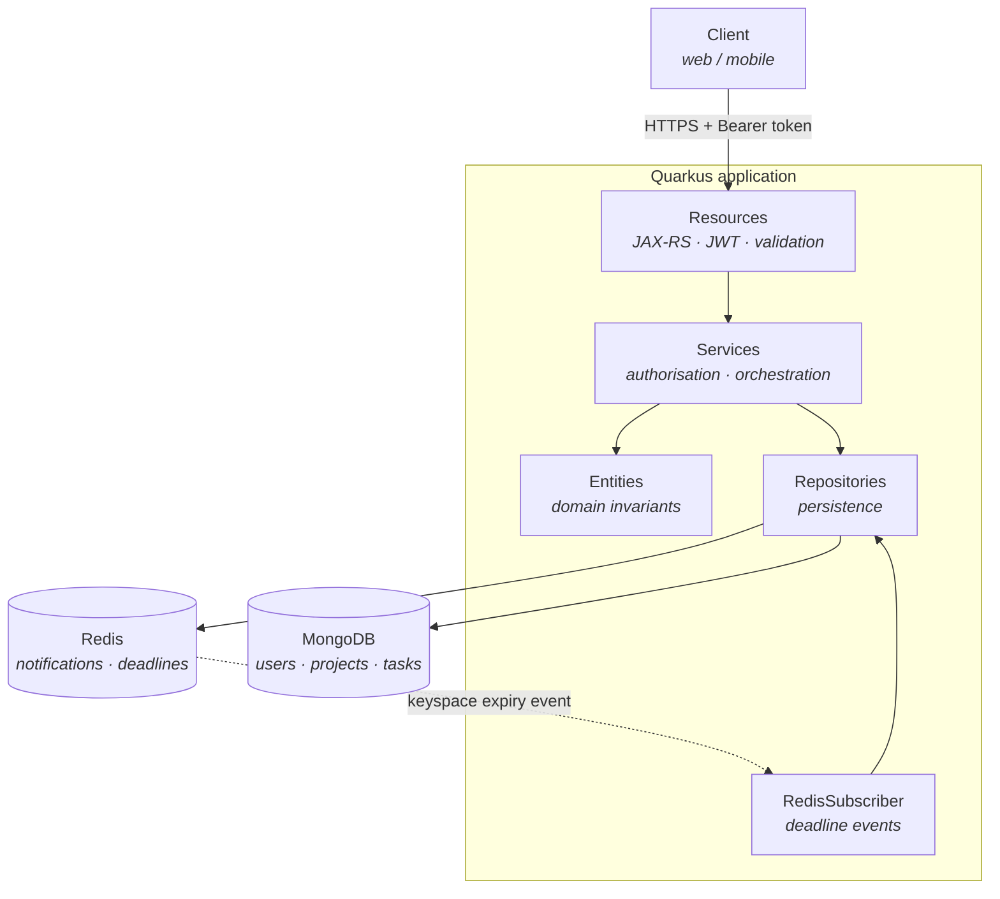
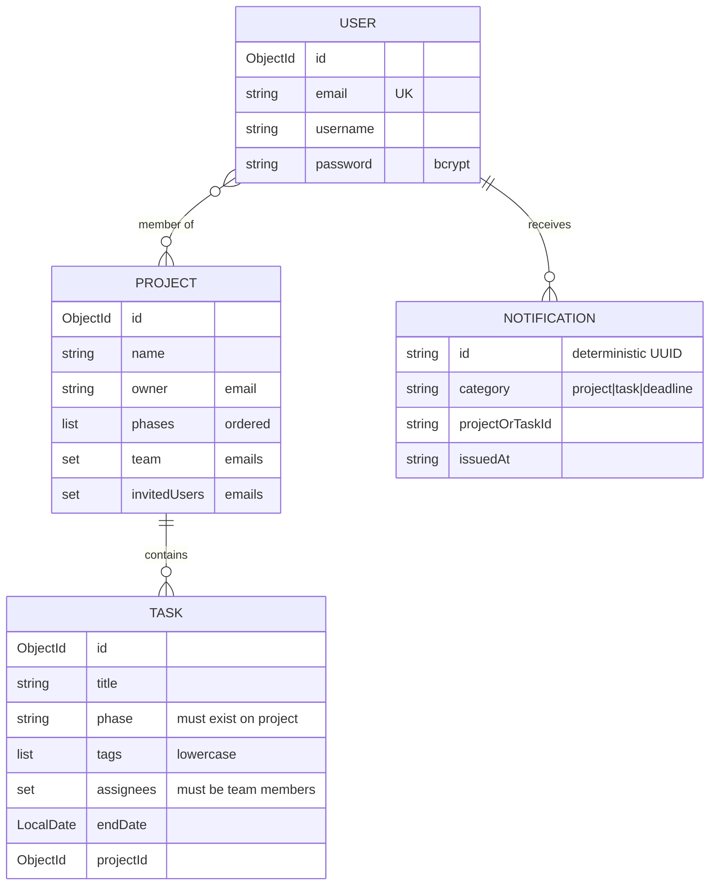

# Trello Clone — Backend API

A Kanban board REST API built with Quarkus, MongoDB and Redis. Users create projects
with customisable phases (columns), invite collaborators, and organise work into tasks
with tags, assignees and deadlines. Notifications are delivered through Redis, including
deadline reminders triggered by key expiry events.

Built as a portfolio project with a focus on **domain invariants, authorisation
correctness and test coverage** rather than feature count. 

## Live demo

**Swagger UI:** https://<your-service>.onrender.com/q/swagger-ui

Log in through `POST /api/auth/login` with:

| Email | Password |
|---|---|
| `demo@trello-clone.dev` | `DemoPass123!` |

Then paste the `accessToken` into the **Authorize** button at the top of Swagger.

The demo account owns a board with four phases, five tasks, one teammate and one
pending invitation. Two other accounts (`teammate@` and `invited@`) share the same
password if you want to see the invitation flow from the other side.

Hosted on a free tier — the first request after a period of inactivity may take up
to a minute while the instance wakes up.
---

## Stack

| Layer | Technology |
|---|---|
| Runtime | Java 21, Quarkus |
| API | JAX-RS (RESTEasy Reactive), OpenAPI / Swagger UI |
| Auth | SmallRye JWT (RS256), BCrypt password hashing |
| Primary store | MongoDB (Panache repositories) |
| Cache / messaging | Redis (hashes, key expiry pub/sub) |
| Testing | JUnit 5, Mockito, RestAssured, Quarkus Dev Services |

---

## Architecture



**Request flow.** Resources handle transport concerns only: token extraction, bean
validation, HTTP status codes. Services own authorisation and coordinate repositories.
Entities protect their own invariants, so a corrupt document cannot be produced by any
code path.

**Deadline flow.** When a task gets a due date, a placeholder key is written to Redis
with a TTL that expires 24 hours before the deadline. Redis emits a keyspace expiry
event, `RedisSubscriber` picks it up, resolves the recipients (assignees, or the whole
team if unassigned) and writes the notification.

---

## Data model



Users are referenced by **email**, not by id — see [Known limitations](#known-limitations).

---

## Running locally

**Prerequisites:** JDK 21, Maven, Docker.

```bash
# 1. Start MongoDB and Redis
docker compose up -d

# 2. Run in dev mode (hot reload)
./mvnw quarkus:dev
```

| Resource | URL |
|---|---|
| Swagger UI | http://localhost:8080/q/swagger-ui |
| OpenAPI spec | http://localhost:8080/q/openapi |
| Dev UI | http://localhost:8080/q/dev |

Redis is started with `--notify-keyspace-events Ex`; without it the deadline
subscriber never receives any event.

MongoDB indexes are created at startup by `MongoIndexInitializer` — a fresh clone
needs no manual setup.

### Running the tests

```bash
./mvnw test
```

Integration tests use **Quarkus Dev Services**, which spin up throwaway MongoDB and
Redis containers automatically. No configuration needed, but Docker must be running.

---

## API overview

All endpoints require a Bearer access token unless marked public. Resources are
annotated `@DenyAll` at class level, so a new endpoint is closed by default until
explicitly opened.

Demo keys replaced by environment configuration in production.

### Authentication

| Method | Path | Description |
|---|---|---|
| `POST` | `/api/auth/login` | Public. Returns an access token (10 min) and a refresh token (1 h) |
| `POST` | `/api/auth/refresh` | Exchanges a refresh token for a new access token |

Failed logins are throttled per account, on top of per-IP rate limiting.

### Users

| Method | Path | Description |
|---|---|---|
| `POST` | `/api/user/register` | Public |
| `GET` | `/api/user` | Current user, from the token |
| `GET` | `/api/user/search?searchTerm=` | Username prefix search, rate limited |
| `PATCH` | `/api/user/update-email` | Requires the current password |
| `PATCH` | `/api/user/update-username` | Requires the current password |
| `PATCH` | `/api/user/update-password` | Requires the current password |

### Projects

| Method | Path | Description |
|---|---|---|
| `GET` | `/api/project` | Projects the caller belongs to |
| `GET` | `/api/project/{projectId}` | Members only |
| `POST` | `/api/project` | Creates a project; the creator becomes owner and member |
| `PATCH` | `/api/project/{projectId}` | Delta update — see below |
| `DELETE` | `/api/project/{projectId}` | Owner only. Cascades to tasks |
| `GET` | `/api/project/invitations` | Pending invitations for the caller |
| `POST` | `/api/project/{projectId}/invitation/accept` | Joins the team |
| `DELETE` | `/api/project/{projectId}/invitation` | Declines |

### Tasks

| Method | Path | Description |
|---|---|---|
| `GET` | `/api/project/{projectId}/task` | Grouped by phase, in board order |
| `GET` | `/api/project/{projectId}/task/{taskId}` | |
| `POST` | `/api/project/{projectId}/task` | |
| `PATCH` | `/api/project/{projectId}/task/{taskId}` | Delta update |
| `DELETE` | `/api/project/{projectId}/task/{taskId}` | Owner or assignees |

Filters: `?tags=bug,urgent&assignees=a@x.com` — `$in` semantics, so a task matching
*any* of the values is returned.

### Notifications

| Method | Path | Description |
|---|---|---|
| `GET` | `/api/notification` | The caller's inbox, grouped by category |
| `DELETE` | `/api/notification/{notificationId}` | Marks one as read |

Notifications are **never created directly through the API**. They are side effects of
inviting a user, assigning a task, or a deadline approaching — which means a
notification cannot exist without the action that justifies it.

---

## Design decisions

### Invariants live on entities, authorisation lives on services

The distinguishing question is whether a rule needs to know anything beyond the
object's own state.

An **invariant** is true regardless of who acts: *the owner is always in the team*,
*nobody is both a member and an invitee*, *phases are unique*. Violating it means the
document is corrupt, so the rule belongs on the entity and holds on every code path.

An **authorisation rule** depends on the caller and is expected to change: *only the
owner can transfer ownership*. It belongs on the service.

`removeMember` shows the split — the entity refuses to remove the owner (invariant),
the service refuses to let a member remove someone else (policy).

A practical consequence: entities have no dependencies, so `ProjectTest` and `TaskTest`
run in milliseconds without Quarkus, Mongo or mocks.

### Partial updates are deltas, not replacements

`PATCH` accepts explicit intent — `phasesToAdd`, `phasesToRemove`, `usersToInvite`,
`assigneesToRemove` — rather than a full desired state. Two users editing the same
project concurrently do not clobber each other's changes, and adding versus removing
can carry different authorisation rules.

Contradictory instructions (the same value in both an add and a remove list) are
rejected **before any mutation**, so a bad request never leaves an entity half-updated.

### Authorisation is evaluated on a snapshot

Permissions are computed once, before mutations begin:

```java
boolean actorIsOwner = project.isOwner(actor);
```

Reading permissions from live state is exploitable: an earlier block in the same request
can change the field the later check depends on. A request could assign itself to a task
and, in the same call, pass the check that assignment was meant to gate.

### Non-members get 404, not 403

Returning "forbidden" confirms a resource exists. Since `ObjectId`s embed a timestamp
and are partially predictable, that turns error codes into an enumeration oracle.
Callers who are not members receive the same response as if the project did not exist.

### Cross-collection access is verified in the query

`findByIdAndProject(taskId, projectId)` verifies ownership in the database rather than
after the fetch, so a task belonging to another project cannot be read, modified or
deleted by passing a project the caller happens to belong to.

### Emails are normalised at every boundary

Lowercased and trimmed on write and on read, backed by a unique index on `users.email`.
Without normalisation, `Mario@x.com` and `mario@x.com` become two accounts — and,
worse, the per-account login throttle becomes trivially bypassable by varying case.

### Notifications live in one Redis hash per user

```
trello-clone:users:{email}:notifications
    ├── {notificationId} → {json}
    └── {notificationId} → {json}
```

The obvious alternative — one key per notification, read back with `KEYS pattern:*` —
scans the entire keyspace on every read, and Redis is single-threaded. Reading an inbox
would block every other client.

Notification ids are **deterministic UUIDs** derived from category, target and
recipient. Re-inviting the same person overwrites instead of duplicating, and the id can
be recomputed later to remove the notification when the invitation is revoked.

Per-field TTL uses `HEXPIRE` (Redis 7.4+), so each notification expires independently.

### Side effects never fail the primary operation

Writing a notification, scheduling a deadline, cascading a phase rename: all happen
**after** the primary save, wrapped in `try/catch` that logs rather than throws.

If Redis is unavailable, the invitation was still persisted. Returning a 500 would make
the user believe the operation was lost and repeat it. Ordering matters too — nothing is
notified before the save that justifies it succeeds.

---

## Testing

| Suite | Type | What it covers |
|---|---|---|
| `ProjectTest`, `TaskTest` | Pure unit | Entity invariants. No Quarkus, no mocks |
| `ProjectServiceTest`, `TaskServiceTest` | Mockito | Authorisation, orchestration, side-effect ordering |
| `*RepositoryTest` | Dev Services | POJO codec round-trip, query correctness, Redis TTL |
| `LoginThrottleTest`, `AuthenticationTokenTest` | RestAssured | End-to-end auth, token group separation |

The layers catch different things, and neither substitutes for the other. Unit tests
found a null-safety gap in a shared helper and an ambiguous exception import; integration
tests found that Panache does not translate `id` to `_id` in hand-written queries —
which would have made every task endpoint return 404 in production, while every mocked
test stayed green.

---

## Known limitations

Deliberate trade-offs, documented rather than hidden.

**Users are identified by email.** Projects store member emails, not user ids. Changing
an email therefore does not follow the user into their projects, and previously issued
tokens still carry the old address. The robust fix is referencing `userId` everywhere;
the change is scoped but touches every collection.

**Refresh tokens are not revocable.** They are stateless JWTs, so there is no real
logout and a stolen token stays valid until it expires. A `refresh_tokens` collection
storing a hash, with rotation on use, would close this.

**Deadline delivery is best-effort.** Redis pub/sub is fire-and-forget: if no subscriber
is connected when a key expires — during a deploy, or if Redis restarts — the event is
lost with no retry. A scheduled job polling `endDate` in MongoDB with a `notifiedAt`
flag would be self-healing; pub/sub was kept because the latency is better and the data
is non-critical.

**Redis and MongoDB can drift.** Deleting a project removes its notifications by
iterating over the members and tasks known at that moment. Users removed earlier keep
stale entries until the TTL clears them. Filtering orphaned notifications at read time
would be self-correcting and is the better long-term design.

**Phases are referenced by name.** Renaming a phase cascades to tasks via a bulk update,
ordered tasks-first so a retry heals a partial failure. Modelling phases as objects with
ids would make the rename a single-field change.

---

## Project structure

```
src/main/java/com/trello/clone/
├── data/
│   ├── model/          Entities: domain behaviour and invariants
│   └── repository/     Panache and Redis persistence
├── service/            Authorisation and orchestration
│   └── exception/      Domain exceptions, mapped to HTTP status codes
├── utils/              Shared helpers (email normalisation, label lists)
└── resource/           JAX-RS endpoints, models and providers
    ├── model/          Entities: web requests and responses models
    ├── provider/       Param converters
    └── resource/       JAX-RS endpoints
```